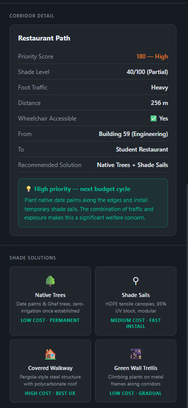
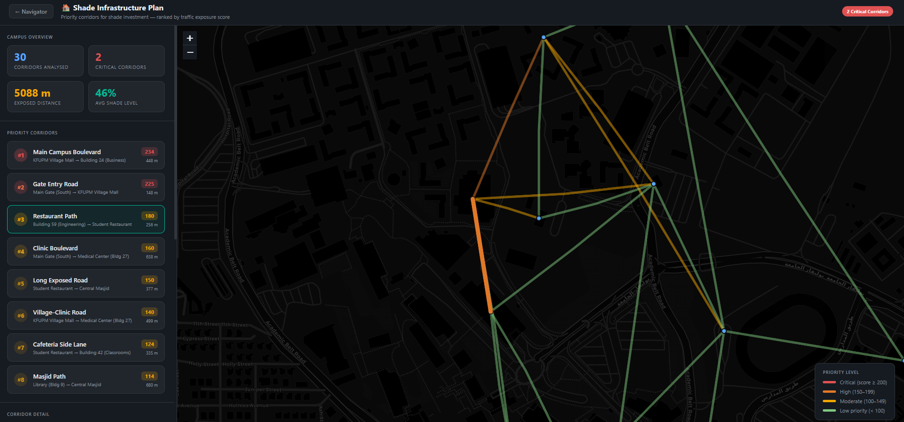
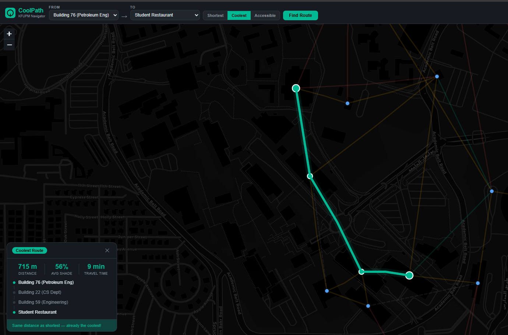
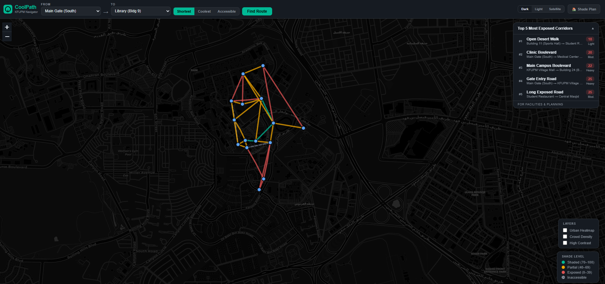

# 🌿 CoolPath — KFUPM Campus Shade Navigator

> A campus routing tool that finds the **coolest, most shaded** walking path between buildings — not just the shortest one.

---

## 📸 Screenshots

### Main Navigator


### Coolest Route Active


### Shade Infrastructure Plan


### Corridor Detail & Recommendations


---

## Overview

Walking across KFUPM in the Saudi summer heat is a genuine welfare issue. A "shortest path" often cuts through fully exposed roads with no shade, putting students and staff at heat-stress risk. **CoolPath** solves this by routing around exposed corridors and surfacing the data planners need to invest in shade infrastructure where it matters most.

The app runs entirely in the browser — no backend, no installation — making it easy to demo on any device.

---

## Key Features

### 🗺️ Interactive Map
- **Dark / Light / Satellite** tile switcher (CartoDB + ESRI)
- All 30 campus walking corridors drawn and shade-coded in real time
- Building markers for 15 KFUPM locations with tooltips

### 🔀 Three Routing Modes
| Mode | Description |
|------|-------------|
| **Shortest** | Classic Dijkstra by distance |
| **Coolest** | Heat-penalised weight: `distance × (1 + 2.5 × exposure)` |
| **Accessible** | Wheelchair-friendly paths only |

### 🌡️ Data Overlays
- **Urban Heatmap** — heat intensity per corridor (red = high exposure)
- **Crowd Density** — path line weight scaled by foot traffic level
- **High Contrast Mode** — full CSS variable override for accessibility

### ♿ Accessibility
- Screen-reader live region announces every route result
- Keyboard-navigable controls with ARIA labels
- High-contrast colour scheme toggle

### 🏠 Shade Infrastructure Plan Page
A dedicated admin page for facilities and planning teams:
- **Priority Score** = `density × (100 − shadeScore)` — higher means more urgent
- Top 8 corridors ranked with per-corridor detail panel
- Interactive map colour-coded by urgency (Critical → Moderate → Low)
- KPI dashboard: exposed distance, critical corridor count, average shade level
- Shade solution guide: native trees, shade sails, covered walkways, green trellises

---

## Tech Stack

| Layer | Technology |
|-------|-----------|
| Map engine | [Leaflet.js 1.9.4](https://leafletjs.com/) (local copy) |
| Tiles | CartoDB Dark/Light · ESRI World Imagery |
| Routing | Dijkstra's algorithm (vanilla JS) |
| Styling | CSS custom properties, dark theme |
| Data | Hardcoded JS — OSM-verified coordinates |
| Hosting | Static files — no backend required |

---

## Routing Algorithm

CoolPath runs **Dijkstra's algorithm** with swappable weight functions:

```js
// Shortest — pure distance
shortestWeight = edge => edge.distance

// Coolest — penalises exposed corridors heavily
coolestWeight  = edge => edge.distance * (1 + 2.5 * (100 - edge.shadeScore) / 100)

// Accessible — same as shortest, but inaccessible edges are skipped
```

The Coolest Route card shows a comparison banner:  
**"+X m longer — 72% shade vs 22% on the shortest path"**

---

## Campus Data

### Buildings (15)
Main Gate · KFUPM Village Mall · Building 24 (Business) · Building 22 (CS) · Building 11 (Sports) · Building 59 (Engineering) · Student Restaurant · Building 76 (Petroleum) · Medical Center · Library · Building 39 · Building 42 (Classrooms) · Central Masjid · Building 58 (Admin) · Building 54

### Paths (30 walking corridors)
Each path includes:
- `shadeScore` — 0 (fully exposed) to 100 (fully shaded)
- `density` — 1 quiet / 2 moderate / 3 heavy
- `accessible` — wheelchair-friendly flag
- `waypoints` — OSM-verified lat/lng array

**Priority scoring for shade investment:**

| Score | Level | Action |
|-------|-------|--------|
| ≥ 200 | 🔴 Critical | Immediate covered walkway or shade sails |
| 150–199 | 🟠 High | Native trees + sails next budget cycle |
| 100–149 | 🟡 Moderate | Targeted planting within 2 years |
| < 100 | 🟢 Low | Routine maintenance only |

---

## Project Structure

```
CoolPath/
├── index.html          # Main app shell
├── shade-plan.html     # Shade infrastructure planning page
├── style.css           # Dark theme + CSS variables
├── app.js              # Map init, Dijkstra, route drawing, overlays
├── data/
│   └── paths.js        # Buildings, paths, heat points
├── lib/
│   ├── leaflet.js      # Leaflet (local, no CDN dependency)
│   └── leaflet.css
└── docs/
    └── screenshots/    # App screenshots for README
```

---

## Demo Route

**Main Gate → Library**

| Mode | Distance | Avg Shade | Time |
|------|----------|-----------|------|
| Shortest | 915 m | 26% | 11 min |
| Coolest  | 1,088 m | 68% | 13 min |

The coolest route avoids the fully exposed Clinic Boulevard and routes through the Shaded Tree Line (shadeScore 75) — 2 extra minutes for dramatically better comfort.

---

## Why It Matters

- Average shade coverage across KFUPM's walking network: **46%**
- Total exposed corridor distance: **5,088 m**
- Peak summer temperatures in Dhahran exceed **45 °C**
- The 2 most critical corridors carry **heavy foot traffic** with shade scores below 25

CoolPath gives both students and facilities planners a common language — a single score that quantifies how urgent each corridor's shade investment is.

---

## Getting Started

No build step needed. Just open `index.html` in a browser, or serve the folder:

```bash
npx serve .
# → http://localhost:3000
```

---

*Built for KFUPM Campus — presentation demo April 2026*
